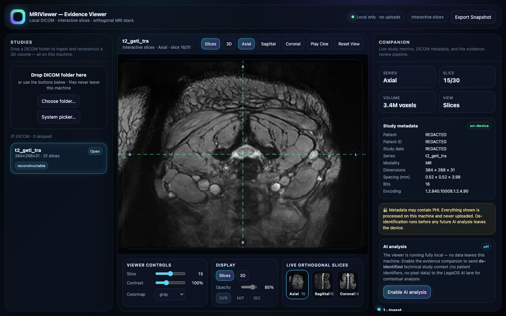
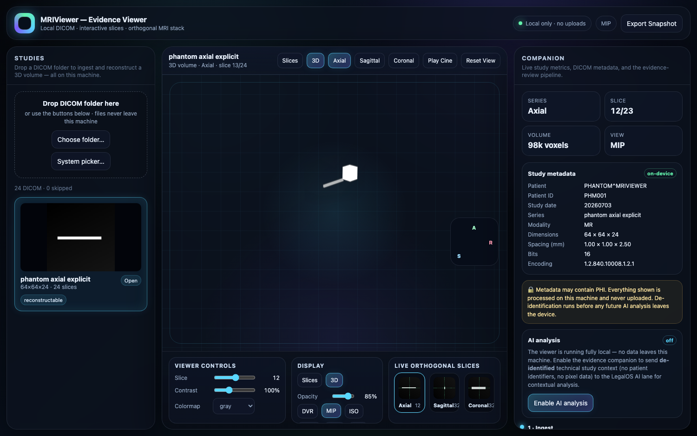

# MRIViewer

Open-source, **local-only** web app for viewing MRI DICOM studies as interactive orthogonal slice stacks with an optional 3D volume renderer.

Drop a folder of DICOM files onto the app and explore the study as linked axial/sagittal/coronal MRI slices. Scrub or play cine through the stack in the large viewport, adjust window/level and colormaps, then switch to the optional 3D DVR/MIP/ISO render mode when you want a volume overview.

Built with **React Three Fiber** on WebGL2. No server, no uploads, no telemetry: everything runs in your browser on `localhost`, and your imaging data never leaves your machine.

> ⚠️ **Not a medical device. Not for diagnostic use.** Educational / research tool. Not affiliated with EPAM's "MRI Viewer".

## Screenshots

The default view is now slice-first: a large interactive MRI plane with linked orthogonal thumbnails, shared crosshair, and cine playback. The real JPEG 2000 screenshot below has visible patient identifiers redacted.



The 3D renderer is still available as a secondary mode for DVR, MIP, and iso-surface exploration.



## Quick start

Requires Node ≥ 20.19 (or ≥ 22.12) and a desktop browser with WebGL2 (Chrome, Edge, or Firefox).

```bash
npm install
npm run dev          # http://localhost:5173
```

Then drag a folder of DICOM files onto the window, or click **Choose folder…**.

To build and run the static bundle (also fully local):

```bash
npm run build
npm run preview      # or: npx serve dist
```

> The build **cannot** be opened via `file://` — ES modules require an HTTP origin. Serve `dist/` from any static server; `localhost` counts as a secure context.

## Features

- **Ingest** — drag-and-drop or folder picker; hundreds of files; multiple studies/series with a thumbnail browser. Files identified by content (`DICM` magic), not extension.
- **Formats** — Implicit/Explicit VR, Deflated, RLE Lossless, Enhanced (multi-frame) MR, and JPEG-family transfer syntaxes including JPEG 2000 via local WASM codecs (see [docs/CODECS.md](docs/CODECS.md)).
- **Slices first** — large axial / sagittal / coronal plane, linked crosshair, wheel scrub, cine playback, A/P/L/R/S/I edge labels, and live orthogonal thumbnails.
- **3D on demand** — raymarched DVR, MIP, and Blinn-Phong shaded iso-surface; orientation gizmo and preset camera views.
- **Tools** — window/level contrast, colormaps, invert, PNG export, metadata panel, and privacy-preserving optional AI companion.

### Keyboard shortcuts

The UI controls expose the current slice, cine playback, orientation, contrast, colormap, invert, export, and optional 3D render modes.

## Privacy

The viewer makes **zero network requests** by default — enforced three ways: a build-time check that `index.html` loads no external resources, a strict runtime CSP (`connect-src 'self'`), and a Playwright test that aborts any non-local request during a full load+render. DICOM headers can contain PHI; nothing is logged or persisted.

## AI companion (optional, off by default)

An optional evidence companion can send a study's **de-identified technical context** (modality, sequence, geometry — never patient identifiers or pixel data) to an LLM for contextual analysis. It is **off by default**; enabling it is a two-step opt-in (configure a key + toggle it on). Even when enabled, the browser makes no external request — the call runs in a local server-side proxy. See [docs/AI.md](docs/AI.md).

## Development

```bash
npm run check        # typecheck + lint + unit tests
npm run phantom      # regenerate synthetic DICOM fixtures
npm test             # Vitest unit tests
npm run e2e          # Playwright (builds + serves + browser tests)
```

The DICOM pipeline (`src/dicom/`) is pure TypeScript and unit-tested against a synthetic **asymmetric phantom** that makes slice ordering, spacing, intensity handling, and — critically — anatomical orientation machine-checkable. See [docs/COORDINATES.md](docs/COORDINATES.md) and [docs/ARCHITECTURE.md](docs/ARCHITECTURE.md).

The full implementation plan is in [docs/PLAN.html](docs/PLAN.html).

## License

MIT — see [LICENSE](LICENSE) and [THIRD_PARTY_NOTICES.md](THIRD_PARTY_NOTICES.md).
